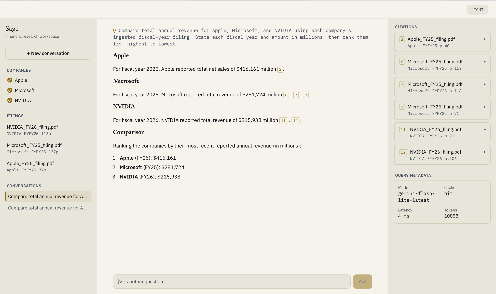
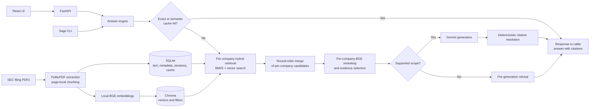

# Sage

A financial research copilot for querying and comparing SEC filings.

[](https://github.com/lakshayxi/sage/actions/workflows/ci.yml)
[](pyproject.toml)

Ask a question about one filing or compare explicitly selected companies. Sage retrieves relevant passages, streams a focused answer, and returns each citation with its source filename, page, and retrieved text.

Sage has been exercised and evaluated on real SEC 10-K filings for **Apple FY2025**, **Microsoft FY2025**, and **NVIDIA FY2026**.



## What Sage does

- **Answers from filing evidence.** Inline citations resolve to the exact passages supplied to the model. The API preserves the source filename, page, chunk ID, company, fiscal year, and passage text.
- **Compares companies without starving either side.** When two or more companies are explicitly selected, Sage runs company-scoped hybrid retrieval with a full candidate budget per company, merges the candidates round-robin, then reranks and selects evidence independently within each company.
- **Refuses unsupported scopes early.** Narrow checks can reject requests for an unavailable company, fiscal year, or named reportable segment before a Gemini call is made.
- **Supports real research sessions.** The React interface streams answers, keeps resumable conversations, exposes company filters, and makes cited passages inspectable beside the answer.

### A verified comparison

One evaluation prompt asks:

> Compare total annual revenue for Apple, Microsoft, and NVIDIA using each company's ingested fiscal-year filing. State each fiscal year and amount in millions, then rank them from highest to lowest.

Sage returned the three filing-specific figures and the correct ranking:

| Rank | Filing | Reported revenue |
|---:|---|---:|
| 1 | Apple FY2025 | $416,161M |
| 2 | Microsoft FY2025 | $281,724M |
| 3 | NVIDIA FY2026 | $215,938M |

The comparison path gives each selected company its own retrieval budget. A company-local query can be used for reranking, while the original question is preserved for generation.

## How it works



The query path combines BM25 keyword search with Chroma vector search through reciprocal rank fusion, then narrows the candidate set with a local cross-encoder. Gemini receives the original question and the selected filing passages. Citation numbers are resolved positionally against those passages rather than trusting model-supplied chunk identifiers.

## Evaluation

The current evaluation is a hand-curated set of 19 checks run uncached through the real retrieval path and, for answerable questions, live Gemini generation.

| Check | Result |
|---|---:|
| Overall | **19/19** |
| Answerable questions | **15/15** |
| Refusals | **4/4** |
| Answerable gold-evidence recall | **15/15** |
| Citation number-to-chunk mapping | **19/19** |
| Citation textual support | **19/19** |
| Company/citation association | **19/19** |

These results cover the three ingested 10-Ks listed above. They measure this corpus and pipeline, not financial question answering in general. The deterministic scorer checks expected figures and keywords, source-file grounding, cited passage support, citation mapping, and company-to-value citation association. The citation totals include four clean no-citation refusals. Company-to-citation association is evaluated directly on comparison questions.

The [evaluation dataset](eval/dataset.py), [scorer](eval/scoring.py), and [runner](eval/run_eval.py) are committed with the project. The latest recorded real-corpus validation is summarized in the [user-testing notes](docs/user-testing/user-testing.md).

Run the full live evaluation with:

```bash
.venv/bin/sage-eval
```

This requires the same three filings, a valid `GEMINI_API_KEY`, and live Gemini access. Every evaluation run disables the answer cache.

## Engineering quality

**290 backend tests pass under Python 3.11.** They cover ingestion deduplication and rollback, page-safe chunking, hybrid and balanced retrieval, reranking, scope refusals, citation integrity, exact and semantic caching, shared streaming/non-streaming retrieval and citation behavior, API validation, upload limits, rate limiting, and conversation isolation. Gemini is replaced with network-free fakes in the test suite; the local embedding and reranking models download from Hugging Face on first use.

The frontend test suite covers stream parsing, Markdown rendering, grouped citations, and right-panel behavior, alongside Oxlint, TypeScript checks, and a production Vite build. CI installs the Python 3.11 dependency lock, runs the backend tests and Ruff checks, then runs the frontend lint, tests, typecheck, and build.

The deployment path is a single CPU-only Docker image that builds the frontend and serves it with FastAPI. The committed image currently requires a corpus to be ingested and packaged before deployment.

## Product surface

| Layer | Implementation |
|---|---|
| Interface | React 19, TypeScript, Vite, Tailwind CSS |
| API | FastAPI with validated JSON and streamed responses |
| Retrieval | BM25 + BGE vector search, reciprocal rank fusion |
| Reranking | Local `BAAI/bge-reranker-base` cross-encoder |
| Generation | Gemini via `google-genai` |
| Storage | SQLite for source text and application state; Chroma for vectors |
| Caching | TTL-based exact and semantic answer caches |
| Ingestion | PyMuPDF, page-local overlapping chunks, SHA-256 deduplication |
| Deployment | Multi-stage, CPU-only Docker image; corpus supplied by the deployer |

Sage exposes the same core pipeline through the browser, FastAPI endpoints, and the `sage` CLI. FastAPI's interactive API documentation is available at `/docs` while the server is running.

## Quick start

### Prerequisites

- Python 3.11
- Node.js 20
- A Gemini API key
- Text-based SEC filing PDFs

The filing PDFs and generated corpus are not distributed in this repository. Download the filings you want to research from SEC EDGAR and place them in `data/raw/`. Sage reads metadata from filenames using this convention:

```text
<Company>_<FiscalYear>_<DocumentType>.pdf
```

For the evaluated corpus:

```text
data/raw/Apple_FY25_filing.pdf
data/raw/Microsoft_FY25_filing.pdf
data/raw/NVIDIA_FY26_filing.pdf
```

### Install

```bash
git clone https://github.com/lakshayxi/sage.git
cd sage

python3.11 -m venv .venv
.venv/bin/pip install -r requirements-lock.txt
.venv/bin/pip install -e . --no-deps

printf 'GEMINI_API_KEY=your-key-here\n' > .env

cd frontend
npm ci
npm run build
cd ..
```

### Ingest and run

```bash
.venv/bin/sage ingest --input-dir data/raw
.venv/bin/uvicorn api.main:app --reload
```

Open [http://localhost:8000](http://localhost:8000). The local embedding and reranking models are downloaded from Hugging Face the first time they are loaded.

You can also query Sage directly from the CLI:

```bash
.venv/bin/sage ask \
  "What was Apple's total net sales in fiscal year 2025?" \
  --company Apple \
  --fiscal-year FY25
```

Explicitly select each company to activate balanced comparison mode:

```bash
.venv/bin/sage ask \
  "Compare total annual revenue using each company's ingested fiscal-year filing." \
  --company Apple \
  --company Microsoft \
  --company NVIDIA
```

### Test

```bash
.venv/bin/python -m pytest tests/
.venv/bin/ruff check .
.venv/bin/ruff format --check .

cd frontend
npm run lint
npm run test
npm run build
```

No Gemini key is needed for the test suite. A network connection is needed the first time the local BGE models are downloaded; subsequent runs can use the local model cache.

## Configuration

Add `GEMINI_API_KEY` to `.env`. Advanced settings for model selection, uploads, caching, and rate limits are defined in [`config/settings.py`](config/settings.py).

## Scope and limitations

- Balanced comparison mode depends on two or more companies being explicitly selected. Company names in free-text alone do not activate per-company retrieval.
- Pre-generation refusals cover narrow company, fiscal-year, and named-segment checks. They do not prove that an arbitrary fact is absent from a filing, and vague questions can still be rejected by the ordinary reranking threshold.
- Ingestion reads the PDF text layer with PyMuPDF. Scanned or image-only filings require OCR before Sage can use them.
- Multi-turn generation receives conversation history, but retrieval runs against the latest question. Follow-ups should restate the financial metric instead of relying only on pronouns.
- Upload ingestion is synchronous and disabled by default. The current Docker deployment directory contains a placeholder corpus; a deployer must ingest and package their own filings.
- Generation requires Gemini. Embedding and reranking run locally, but their model weights must be downloaded before offline use.

## License

This public repository is source-visible for portfolio and demonstration purposes, but it is not open-source licensed. The code is **All Rights Reserved** and reuse requires permission from the copyright holder. See [`LICENSE`](LICENSE).
