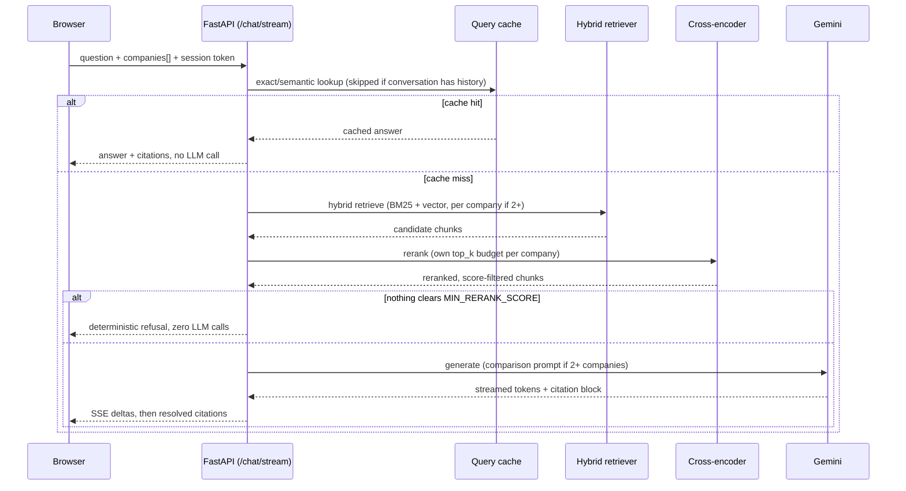

# Sage

**An AI-native financial research workspace — not "chat with your PDFs."** Ask a question about a real 10-K filing and get a grounded, page-cited answer in seconds, with retrieval quality and citation trust treated as the product, not an afterthought.

Sage ingests SEC filings, retrieves the right passages with hybrid search + cross-encoder reranking, and generates cited answers via Gemini — streamed live into a three-panel workspace UI built for cross-company comparison, not single-document chat.

---

## Why Sage exists

Most "chat with your PDF" tools optimize for a demo, not for trust. Sage is built around two harder constraints instead:

- **Every claim must be citeable to an exact source chunk** — page number, company, fiscal year — or the system says so and refuses to answer, rather than generating a plausible-sounding guess.
- **Comparing companies is a first-class query shape**, not an afterthought bolted onto single-document Q&A — "compare Apple, Microsoft, and NVIDIA's R&D spend" gets a structured, per-company answer with its own retrieval budget for each company, not one blended paragraph.

## Features

- **Grounded, cited answers** — every factual claim resolves to a specific ingested chunk (company / fiscal year / doc type / page), with a hard relevance gate: if nothing retrieved clears the cross-encoder's relevance threshold, the LLM is never even called.
- **Compare Mode** — ask about multiple companies in one query; each company gets its own independent retrieval and reranking budget instead of sharing one pool, and the prompt auto-switches to a structured per-company-then-comparison format.
- **Hybrid retrieval** — BM25 keyword search + vector similarity, fused via reciprocal rank fusion, narrowed by a `BAAI/bge-reranker-base` cross-encoder.
- **Fully local embeddings** — `sentence-transformers` (`BAAI/bge-small-en-v1.5`) runs in-process, so retrieval has zero API cost and zero quota risk; only generation calls out to Gemini.
- **Live streaming answers** over SSE, with a fence-buffered stream so the model's internal citation-JSON block never leaks into what the user sees typing.
- **Resumable, session-isolated conversations** — multi-turn history per conversation, scoped to an unguessable per-visitor session token so one visitor can never read another's questions or answers.
- **Two-layer query cache** — exact-match (SQLite) checked first, semantic (embedding-similarity, Chroma-backed) on a miss, both TTL-expiring.
- **Public-deployment guardrails** — a shared demo-key gate, per-route rate limiting, and an upload kill-switch (`ALLOW_UPLOADS=false`) so a public demo can't be turned into an open PDF-processing service.

## Architecture


Embeddings are the one deliberate asymmetry in this diagram: generation depends on an external API (Gemini), but retrieval — the part that runs on *every single query*, not just at ingest time — never does. That split is a direct consequence of a real Gemini free-tier embedding quota wall hit during development (see [Design decisions](#design-decisions)).

## Query lifecycle



## Tech stack

| Layer | Technology |
|---|---|
| Frontend | React 19 + TypeScript, Vite 8, Tailwind CSS 4 |
| API | FastAPI, SSE streaming, `slowapi` rate limiting |
| Generation | Gemini API (`gemini-flash-lite-latest` by default) — the only paid/networked call in the query path |
| Embeddings | `sentence-transformers` (`BAAI/bge-small-en-v1.5`, 384-d), fully local |
| Reranking | `sentence-transformers` `CrossEncoder` (`BAAI/bge-reranker-base`) |
| Keyword retrieval | `rank-bm25` |
| Vector store | Chroma |
| Relational store | SQLite via SQLAlchemy |
| PDF parsing | PyMuPDF |
| Deployment | Docker (single image, frontend + API), Hugging Face Spaces |

## Folder structure

```
sage/
├── api/                  # FastAPI app: routes, schemas, middleware, rate limiting
│   └── routes/           # chat.py, conversations.py, documents.py
├── sage/                 # Core backend package
│   ├── ingest/            # PDF loading, paragraph-aware chunking, metadata parsing
│   ├── embed/              # Local sentence-transformers embedder
│   ├── retrieval/          # Hybrid (BM25+vector) retrieval, cross-encoder reranker
│   ├── generation/         # Prompts, citation parsing, answer_engine.py orchestration, cache
│   ├── db/                 # SQLAlchemy models + conversation/query-log helpers
│   ├── cli.py              # sage ingest / ask / conversations
│   └── retry.py            # Backoff wrapper for Gemini 429/5xx
├── frontend/              # React + Vite workspace UI (three-panel layout)
│   └── src/
│       ├── api/             # Typed fetch/EventSource client, session-token handling
│       ├── components/      # Sidebar, MainPanel, RightPanel, citation UI
│       ├── context/         # Bidirectional citation-highlight state
│       └── hooks/           # useChatSession (SSE consumption), useTheme
├── config/settings.py     # All env-overridable configuration, single source of truth
├── deploy/huggingface/    # Space config, deploy guide, pre-ingested demo corpus
├── scripts/deploy_hf_space.py
├── Dockerfile             # Single image: node build stage + python runtime stage
├── docs/
│   ├── reviews/            # Dated pre-deploy code + security review logs
│   └── user-testing/        # Dated live-testing session logs
└── tests/                 # 144 tests, no live Ollama/Gemini required
```

## API reference

| Method | Path | Purpose |
|---|---|---|
| `POST` | `/chat` | Non-streaming Q&A — answer + resolved citations in one response |
| `GET` | `/chat/stream` | Same, as an SSE token stream |
| `POST` | `/conversations` | Start a new conversation, returns `conversation_id` + a session token |
| `GET` | `/conversations` | List conversations belonging to the caller's session token |
| `GET` | `/conversations/{id}` | Full message history for one conversation (session-scoped) |
| `GET` | `/documents` | List ingested filings |
| `POST` | `/documents/upload` | Upload a PDF (multipart) — 403s when `ALLOW_UPLOADS=false` |

Real `POST /chat` response shape (trimmed):

```json
{
  "schema_version": 1,
  "answer": "Apple's total net sales for fiscal year 2025 were $416,161 million [1, 3].",
  "citations": [
    { "n": 1, "chunk_id": 49, "page_number": 48, "company": "Apple",
      "fiscal_year": "FY25", "doc_type": "filing", "filename": "Apple_FY25_filing.pdf" }
  ],
  "model": "gemini-flash-lite-latest",
  "latency_ms": { "retrieval_ms": 8201.5, "generation_ms": 7885.9, "total_ms": 25059.6 },
  "tokens": { "prompt_tokens": 6692, "completion_tokens": 255, "total_tokens": 6947 },
  "cache_hit": false,
  "cost_usd": 0.0,
  "session_id": null
}
```

Comparison queries (`"companies": ["Apple", "Microsoft", "NVIDIA"]`) return a structured per-company answer with a closing comparison section, each company's claims independently citeable.

## Configuration

All settings live in `config/settings.py`, loaded via `python-dotenv` from a `.env` file at the repo root (never committed — see `.gitignore`).

| Variable | Default | Purpose |
|---|---|---|
| `GEMINI_API_KEY` | *(required)* | Generation is Gemini-only — nothing answers without this |
| `GEMINI_CHAT_MODEL` | `gemini-flash-lite-latest` | Live-verified working when `gemini-flash-latest` hit a Google-side capacity issue |
| `SAGE_EMBEDDING_MODEL` | `BAAI/bge-small-en-v1.5` | Local embedding model — changing this requires re-ingesting (`data/chroma/` vector dimensionality changes) |
| `DEMO_ACCESS_KEY` | unset (no-op) | Gates `/chat`, `/conversations`, `/documents` behind a shared key on public deployments |
| `VITE_DEMO_ACCESS_KEY` | unset | Build-time frontend counterpart to `DEMO_ACCESS_KEY` — must match, baked in at `npm run build` |
| `ALLOW_UPLOADS` | `true` | Set `false` on public deployments — the curated-demo boundary |
| `CHAT_RATE_LIMIT` | `10/minute` | `slowapi` rate-limit spec applied to `/chat`, `/chat/stream`, and uploads |

## Installation

Requires Python ≥3.11 and Node 20 for the frontend.

```bash
python3 -m venv .venv
.venv/bin/pip install -e ".[dev]"
echo "GEMINI_API_KEY=your-key-here" > .env

cd frontend
npm ci
npm run build   # produces frontend/dist, served by the same FastAPI process
```

## Quick start

```bash
# ingest real filings
.venv/bin/sage ingest --input-dir data/raw

# ask from the CLI
.venv/bin/sage ask "What was Apple's revenue in fiscal 2025?"

# or run the full app
.venv/bin/uvicorn api.main:app --reload
# → open http://localhost:8000/
```

## Usage examples

Compare Mode from the CLI (repeat `--company` to trigger it):

```bash
.venv/bin/sage ask "Compare R&D spend trends" --company Apple --company Microsoft --company NVIDIA
```

Streaming from the API:

```bash
curl -N "http://localhost:8000/chat/stream?query=How+did+NVIDIA%27s+gross+margin+change&companies=NVIDIA"
```

Resuming a conversation:

```bash
curl -X POST http://localhost:8000/conversations -d '{"title":"Apple FY25 deep dive"}' \
  -H "Content-Type: application/json"
# → {"conversation_id": 1, "session_token": "..."}

curl http://localhost:8000/conversations/1 -H "X-Session-Token: <token from above>"
```

Running the test suite (no live Gemini/network required):

```bash
.venv/bin/python -m pytest tests/
.venv/bin/ruff check . && .venv/bin/ruff format --check .
```

## Design decisions

**Embeddings run locally; generation doesn't.** Gemini's free embedding tier hit a hard, non-recoverable quota wall during development — and embeddings are needed on every single query (not just at ingest time), making that a structural risk rather than a one-off. Swapping to a local `sentence-transformers` model removed the risk entirely while keeping generation on Gemini, where the same problem never surfaced in practice.

**Compare Mode gives each company its own retrieval and reranking budget, not a shared one.** An earlier version reranked all companies' candidates together against one shared `top_k`, which let whichever company's chunks scored marginally higher crowd out the others — a 3-company query could come back with real data for one company and "insufficient context" for the rest, even when the data existed. Each company now gets an independently reranked, independently budgeted slice of context.

**Session isolation via an unguessable token, not a login system.** Conversations are scoped to a server-issued `secrets.token_urlsafe(32)` stored client-side, not a user account — enough to stop one visitor reading another's history on a public demo, without building auth for a single-operator portfolio project.

**The demo-key guardrail supports a query parameter, not just a header.** The browser's native `EventSource` (used for the streaming endpoint) cannot set custom request headers — a hard platform limitation — so `DemoKeyMiddleware` accepts the key via `?key=` for that one endpoint, and a header everywhere else.

## Known limitations

- **Free Hugging Face Spaces have ephemeral storage** — conversations and cache writes on the public deployment don't survive a Space restart.
- **The reranker model isn't baked into the deployment image** — it downloads from the HF Hub lazily on first use, so the first query after a cold start is noticeably slower than the rest.
- **No OCR fallback** — PDF text extraction (PyMuPDF) is direct-text-layer only; scanned/image-only filings would extract little or no text.
- **`MIN_RERANK_SCORE` (0.1) is an empirically-probed starting point**, carried over from a sibling project's corpus, not exhaustively tuned against Sage's own filings.
- **`ALLOW_UPLOADS` defaults to `true`** — must be explicitly set `false` on any public deployment; there's no separate default for "local" vs "public" beyond this one flag.

## Security notes

- Conversation history is session-token scoped (see [Design decisions](#design-decisions)) — cross-session reads 404 rather than leaking another visitor's data.
- File upload sanitizes the filename to its basename and verifies the resolved destination path stays inside the intended upload directory before writing, rejecting path-traversal attempts.
- `POST /documents/upload` is rate-limited and disabled outright (`403`) when `ALLOW_UPLOADS=false`, which is the documented setting for the public deployment.
- There is no user-account authentication anywhere — `DEMO_ACCESS_KEY` is a single shared secret for gating an entire deployment, not per-visitor identity.

## Quality & verification

Two dated, real logs — not just "tests pass":

- **`docs/reviews/2026-07-18-pre-deploy-review.md`** — a structured, multi-agent code + security review of the full codebase before first deployment; 10 confirmed findings (including a conversation-history access-control gap), all fixed and independently re-verified.
- **`docs/user-testing/user-testing.md`** — bugs surfaced by hand-driving the live app, including a real SSE stream-truncation bug and a config bug where `GEMINI_API_KEY` silently never loaded at runtime.

144 tests (`tests/`) run with no live Ollama/Gemini dependency — network-free fakes stand in for the Gemini client; retrieval, reranking, and embedding tests run against real local models.

## Deployment

Single Docker image (frontend build stage + Python runtime stage) targeting a free Hugging Face Docker Space — chosen specifically for its 16GB RAM, which the cross-encoder reranker needs. A pre-ingested demo corpus (Apple, Microsoft, and NVIDIA 10-Ks) is baked into the image so the public demo works with zero setup. Full walkthrough, required secrets, and rollback steps: [`deploy/huggingface/DEPLOY.md`](deploy/huggingface/DEPLOY.md).

## Status

Personal portfolio project — the public-facing half of a two-repo project. The research/experimentation half, where retrieval and generation techniques get proven before graduating here, lives at [Sage Research](https://github.com/lakshayxi/sage-research). No LICENSE file is present in this repo.
