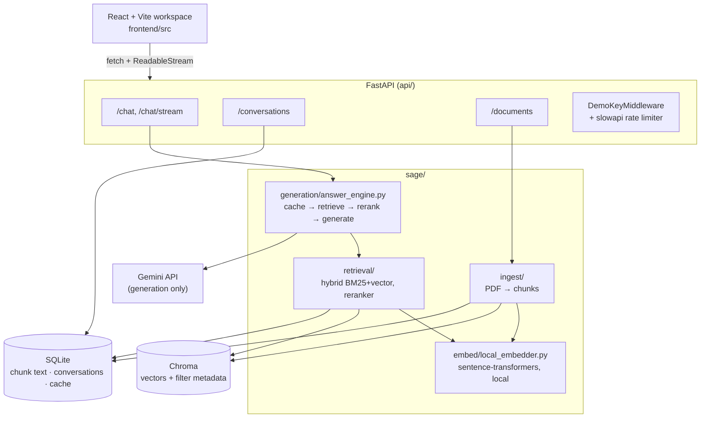
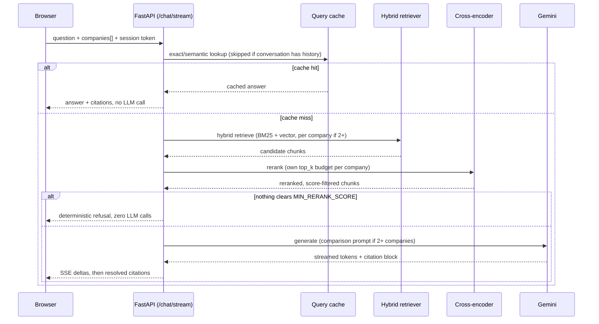

# Sage

**An AI-native financial research workspace — not "chat with your PDFs."** Ask a question about a real 10-K filing and get a grounded, page-cited answer in seconds, with retrieval quality and citation trust treated as the product, not an afterthought.

Sage ingests SEC filings, retrieves the right passages with hybrid search + cross-encoder reranking, and generates cited answers via Gemini — streamed live into a three-panel workspace UI built for cross-company comparison, not single-document chat.

---

## Why Sage exists

Most "chat with your PDF" tools optimize for a demo, not for trust. Sage is built around two harder constraints instead:

- **Every claim must be citeable to an exact source chunk** — page number, company, fiscal year — or the system says so and refuses to answer, rather than generating a plausible-sounding guess.
- **Comparing companies is a first-class query shape**, not an afterthought bolted onto single-document Q&A — "compare Apple, Microsoft, and NVIDIA's R&D spend" gets a structured, per-company answer with its own retrieval budget for each company, not one blended paragraph.

## Features

- **Grounded, cited answers** — every factual claim resolves to a specific ingested chunk (company / fiscal year / doc type / page), with a hard relevance gate: if nothing retrieved clears the cross-encoder's relevance threshold, the LLM is never even called. Citation numbers resolve deterministically by position against the chunks actually shown to the model — a citation's identity is never taken from the model's own (possibly wrong) `chunk_id` echo.
- **Compare Mode** — ask about multiple companies in one query; each company gets its own independent retrieval and reranking budget instead of sharing one pool, and the prompt auto-switches to a structured per-company-then-comparison format.
- **Hybrid retrieval** — BM25 keyword search + vector similarity, fused via reciprocal rank fusion, narrowed by a `BAAI/bge-reranker-base` cross-encoder. A query is embedded exactly once per request and reused across the semantic cache check and every company's retrieval call in a comparison query, not re-embedded per company.
- **Fully local embeddings** — `sentence-transformers` (`BAAI/bge-small-en-v1.5`) runs in-process, so retrieval has zero API cost and zero quota risk; only generation calls out to Gemini.
- **Live streaming answers** via `fetch()` + a streamed `ReadableStream` (not `EventSource`), so the query, filters, and session token travel in a POST body/headers instead of a URL query string — with a fence-buffered stream so the model's internal citation-JSON block never leaks into what the user sees typing.
- **Resumable, session-isolated conversations** — multi-turn history per conversation, scoped to an unguessable per-visitor session token so one visitor can never read another's questions or answers.
- **Two-layer query cache** — exact-match (SQLite) checked first, semantic (embedding-similarity, Chroma-backed) on a miss, both TTL-expiring; an expired row is refreshed in place by the next generated answer rather than blocking future writes forever.
- **Page-exact chunking** — a chunk never spans a page boundary and an oversized paragraph is split into bounded, overlapping windows, so a citation's page number is always exactly right, never just "the page the chunk started on."
- **Recoverable, idempotent ingestion** — a checksum-based dedup skips re-ingesting identical file content, and a failure partway through cleans up any Chroma vectors already written so nothing is orphaned across the two separate (non-transactional) stores.
- **Retrieval-quality eval harness** (`sage-eval`) — an 18-item hand-curated Q&A set (including multi-turn follow-ups and distractor-adjacent unanswerable items) run against the real ingested corpus with caching disabled, scored on numeric correctness, citation grounding, citation-text support, recall@k, and citation-number mapping validity — not just "did retrieval return something."
- **Public-deployment guardrails** — a rate-limited, non-secret demo-access deterrent (not a real auth boundary — see Design decisions), and uploads disabled by default (`ALLOW_UPLOADS=false`) with streamed/bounded/content-validated writes when enabled, so a public demo can't be turned into an open PDF-processing service.

## Architecture



Embeddings are the one deliberate asymmetry in this diagram: generation depends on an external API (Gemini), but retrieval — the part that runs on *every single query*, not just at ingest time — never does. That split is a direct consequence of a real Gemini free-tier embedding quota wall hit during development (see [Design decisions](#design-decisions)).

## Query lifecycle



## Tech stack

| Layer | Technology |
|---|---|
| Frontend | React 19 + TypeScript, Vite 8, Tailwind CSS 4 |
| API | FastAPI, SSE streaming, `slowapi` rate limiting |
| Generation | Gemini API (`gemini-flash-lite-latest` by default) — the only paid/networked call in the query path |
| Embeddings | `sentence-transformers` (`BAAI/bge-small-en-v1.5`, 384-d), fully local |
| Reranking | `sentence-transformers` `CrossEncoder` (`BAAI/bge-reranker-base`) |
| Keyword retrieval | `rank-bm25` |
| Vector store | Chroma |
| Relational store | SQLite via SQLAlchemy |
| PDF parsing | PyMuPDF |
| Deployment | Docker (single image, frontend + API), Hugging Face Spaces |

## Folder structure

```
sage/
├── api/                  # FastAPI app: routes, schemas, middleware, rate limiting
│   └── routes/           # chat.py, conversations.py, documents.py
├── sage/                 # Core backend package
│   ├── ingest/            # PDF loading, paragraph-aware chunking, metadata parsing
│   ├── embed/              # Local sentence-transformers embedder
│   ├── retrieval/          # Hybrid (BM25+vector) retrieval, cross-encoder reranker
│   ├── generation/         # Prompts, citation parsing, answer_engine.py orchestration, cache
│   ├── db/                 # SQLAlchemy models + conversation/query-log helpers
│   ├── cli.py              # sage ingest / ask / conversations
│   └── retry.py            # Backoff wrapper for Gemini 429/5xx
├── frontend/              # React + Vite workspace UI (three-panel layout)
│   └── src/
│       ├── api/             # Typed fetch client (incl. streamed ReadableStream parsing), session-token handling
│       ├── components/      # Sidebar, MainPanel, RightPanel, citation UI
│       ├── context/         # Bidirectional citation-highlight state
│       └── hooks/           # useChatSession (SSE consumption), useTheme
├── config/settings.py     # All env-overridable configuration, single source of truth
├── deploy/huggingface/    # Space config, deploy guide, pre-ingested demo corpus
├── scripts/deploy_hf_space.py
├── Dockerfile             # Single image: node build stage + python runtime stage
├── .github/workflows/ci.yml  # Backend tests+ruff, frontend lint+typecheck+build
├── requirements-lock.txt  # Reproducible pinned deps (pip freeze), see Installation
├── docs/
│   ├── reviews/            # Dated pre-deploy code + security review logs
│   └── user-testing/        # Dated live-testing session logs
├── eval/                  # Hand-curated Q&A eval harness (sage-eval)
└── tests/                 # 224 tests, no live Gemini required
```

## API reference

| Method | Path | Purpose |
|---|---|---|
| `POST` | `/chat` | Non-streaming Q&A — answer + resolved citations in one response |
| `POST` | `/chat/stream` | Same, as an SSE-formatted token stream (fetch + `ReadableStream` on the frontend, not `EventSource` — query/filters in the body, session token as a header) |
| `POST` | `/conversations` | Start a new conversation, returns `conversation_id` + a session token |
| `GET` | `/conversations` | List conversations belonging to the caller's session token |
| `GET` | `/conversations/{id}` | Full message history for one conversation (session-scoped) |
| `GET` | `/documents` | List ingested filings |
| `POST` | `/documents/upload` | Upload a PDF (multipart) — 403s when `ALLOW_UPLOADS=false` |

Real `POST /chat` response shape (trimmed):

```json
{
  "schema_version": 1,
  "answer": "Apple's total net sales for fiscal year 2025 were $416,161 million [1, 3].",
  "citations": [
    { "n": 1, "chunk_id": 49, "page_number": 48, "company": "Apple",
      "fiscal_year": "FY25", "doc_type": "filing", "filename": "Apple_FY25_filing.pdf" }
  ],
  "model": "gemini-flash-lite-latest",
  "latency_ms": { "retrieval_ms": 8201.5, "generation_ms": 7885.9, "total_ms": 25059.6 },
  "tokens": { "prompt_tokens": 6692, "completion_tokens": 255, "total_tokens": 6947 },
  "cache_hit": false,
  "cost_usd": 0.0,
  "session_id": null
}
```

Comparison queries (`"companies": ["Apple", "Microsoft", "NVIDIA"]`) return a structured per-company answer with a closing comparison section, each company's claims independently citeable.

## Configuration

All settings live in `config/settings.py`, loaded via `python-dotenv` from a `.env` file at the repo root (never committed — see `.gitignore`).

| Variable | Default | Purpose |
|---|---|---|
| `GEMINI_API_KEY` | *(required)* | Generation is Gemini-only — nothing answers without this |
| `GEMINI_CHAT_MODEL` | `gemini-flash-lite-latest` | Live-verified working when `gemini-flash-latest` hit a Google-side capacity issue |
| `SAGE_EMBEDDING_MODEL` | `BAAI/bge-small-en-v1.5` | Local embedding model — changing this requires re-ingesting (`data/chroma/` vector dimensionality changes) |
| `DEMO_ACCESS_KEY` | unset (no-op) | Gates `/chat`, `/conversations`, `/documents` behind a shared key on public deployments |
| `VITE_DEMO_ACCESS_KEY` | unset | Build-time frontend counterpart to `DEMO_ACCESS_KEY` — must match, baked in at `npm run build` |
| `ALLOW_UPLOADS` | `false` | Set `true` to allow `POST /documents/upload` — off by default (fail closed) so a deployment that forgets to set this doesn't accidentally expose an open PDF-upload service |
| `MAX_UPLOAD_BYTES` | `26214400` (25MB) | Hard ceiling on a single upload's size, enforced while it streams to disk |
| `MAX_UPLOAD_PAGES` | `500` | Hard ceiling on a single upload's page count, checked before ingestion |
| `MAX_QUERY_LENGTH` | `2000` | Hard ceiling on a single chat query's character length |
| `CHAT_RATE_LIMIT` | `10/minute` | `slowapi` rate-limit spec applied to `/chat`, `/chat/stream`, and uploads |

## Installation

Requires Python ≥3.11 and Node 20 for the frontend.

```bash
python3 -m venv .venv
.venv/bin/pip install -e ".[dev]"
echo "GEMINI_API_KEY=your-key-here" > .env

cd frontend
npm ci
npm run build   # produces frontend/dist, served by the same FastAPI process
```

For a reproducible install pinned to exact versions instead of `pyproject.toml`'s `>=` floors, use the committed lock file (`requirements-lock.txt`, generated via `pip freeze` — see its header comment for how to regenerate after a dependency change):

```bash
.venv/bin/pip install -r requirements-lock.txt
.venv/bin/pip install -e . --no-deps
```

## Quick start

```bash
# ingest real filings
.venv/bin/sage ingest --input-dir data/raw

# ask from the CLI
.venv/bin/sage ask "What was Apple's revenue in fiscal 2025?"

# check retrieval/generation quality against the hand-curated eval set
.venv/bin/sage-eval --limit 3

# or run the full app
.venv/bin/uvicorn api.main:app --reload
# → open http://localhost:8000/
```

## Usage examples

Compare Mode from the CLI (repeat `--company` to trigger it):

```bash
.venv/bin/sage ask "Compare R&D spend trends" --company Apple --company Microsoft --company NVIDIA
```

Streaming from the API (POST with a JSON body, not a query-string GET — see [Design decisions](#design-decisions)):

```bash
curl -N -X POST http://localhost:8000/chat/stream \
  -H "Content-Type: application/json" \
  -d '{"query": "How did NVIDIA'"'"'s gross margin change", "companies": ["NVIDIA"]}'
```

Resuming a conversation:

```bash
curl -X POST http://localhost:8000/conversations -d '{"title":"Apple FY25 deep dive"}' \
  -H "Content-Type: application/json"
# → {"conversation_id": 1, "session_token": "..."}

curl http://localhost:8000/conversations/1 -H "X-Session-Token: <token from above>"
```

Running the test suite (no live Gemini/network required):

```bash
.venv/bin/python -m pytest tests/
.venv/bin/ruff check . && .venv/bin/ruff format --check .
```

## Design decisions

**Embeddings run locally; generation doesn't.** Gemini's free embedding tier hit a hard, non-recoverable quota wall during development — and embeddings are needed on every single query (not just at ingest time), making that a structural risk rather than a one-off. Swapping to a local `sentence-transformers` model removed the risk entirely while keeping generation on Gemini, where the same problem never surfaced in practice.

**Queries get BGE's asymmetric instruction prefix; indexed passages don't.** `BAAI/bge-small-en-v1.5` is documented to benefit from a `"Represent this sentence for searching relevant passages: "` prefix on the query side only — passages stay unprefixed so already-indexed Chroma vectors remain valid without a re-ingest. `sage/embed/local_embedder.py`'s `embed_query()` applies the prefix and is used by retrieval and the semantic cache; ingestion still calls the unprefixed `embed_text()`/`embed_texts()`.

**Compare Mode gives each company its own retrieval and reranking budget, not a shared one.** An earlier version reranked all companies' candidates together against one shared `top_k`, which let whichever company's chunks scored marginally higher crowd out the others — a 3-company query could come back with real data for one company and "insufficient context" for the rest, even when the data existed. Each company now gets an independently reranked, independently budgeted slice of context.

**Session isolation via an unguessable token, not a login system.** Conversations are scoped to a server-issued `secrets.token_urlsafe(32)` stored client-side, not a user account — enough to stop one visitor reading another's history on a public demo, without building auth for a single-operator portfolio project.

**Streaming is `fetch()` + `ReadableStream`, not `EventSource`.** The browser's native `EventSource` can only issue GET requests and can't set custom headers, which used to force the query text, session token, and demo access key into the `/chat/stream` URL's query string — leaking into server access logs, browser history, and any `Referer` header. `POST /chat/stream` now takes the query/filters as a JSON body and the session token as an `X-Session-Token` header, exactly like `POST /chat`, and the frontend reads the streamed response body incrementally instead of relying on the browser's SSE parser. `DemoKeyMiddleware` only accepts the key via the `X-Demo-Key` header now — no query-param fallback remains, since every client here is `fetch()`-based and can set real headers.

**The demo access key is a casual-access deterrent, not a real secret.** `VITE_DEMO_ACCESS_KEY` is compiled into the public JS bundle by Vite at build time — anyone can read it straight out of the deployed site's own source, so it cannot be an authentication boundary. It exists to keep an unlisted demo URL out of casual crawler/scraper traffic, not to stop a deliberate actor; the actual defense against abuse of the costly Gemini-backed endpoints is `CHAT_RATE_LIMIT` (per-IP, applied to every chat and upload route). A deployment that needs real access control should put this app behind its own auth layer rather than treating `DEMO_ACCESS_KEY` as one.

**Citation identity is positional, never taken from the model's own `chunk_id`.** The model is shown chunks labeled `[1]`, `[2]`, ... in the prompt and asked to cite bracket numbers; `_resolve_citations` (`sage/generation/answer_engine.py`) resolves `[n]` to `chunks[n - 1]` deterministically and ignores any `chunk_id` the model echoes back. Trusting the model's `chunk_id` would let a hallucinated or malformed value silently remap a visible `[1]` citation to a completely different retrieved chunk than the one actually shown as `[1]`.

**Chunks never cross a page boundary.** Each page is chunked independently (`sage/ingest/chunker.py`), and a paragraph alone larger than `CHUNK_TOKENS` is split into bounded, overlapping windows rather than becoming one unbounded chunk. **No re-ingestion is required** for documents ingested before this fix — the schema didn't change, and existing chunks remain valid and citable — but any chunk that happened to span two pages under the old chunker keeps its (slightly imprecise) page attribution until that document is re-ingested.

**Ingestion is idempotent via a content checksum, with compensating cleanup on failure.** `sage/ingest/pipeline.py` hashes the raw PDF and skips re-ingesting identical content already marked `ready`; if a failure happens after Chroma vectors were written but before the SQLite transaction commits, those specific vectors are deleted rather than left orphaned. Documents ingested before this fix have no checksum (`NULL`, backfilled automatically as a schema migration on next startup) and simply don't participate in dedup until re-ingested — never a false match. This doesn't fully serialize a genuine *concurrent* double-ingest of a brand-new file (a rare race for a synchronous, mostly-CLI/admin-driven operation, not hardened against here).

## Known limitations

- **Free Hugging Face Spaces have ephemeral storage** — conversations and cache writes on the public deployment don't survive a Space restart.
- **The reranker model isn't baked into the deployment image** — it downloads from the HF Hub lazily on first use, so the first query after a cold start is noticeably slower than the rest.
- **No OCR fallback** — PDF text extraction (PyMuPDF) is direct-text-layer only; scanned/image-only filings would extract little or no text.
- **`MIN_RERANK_SCORE` (0.1) is still an empirically-probed starting point, not exhaustively tuned** — carried over from a sibling project's corpus, but no longer untouched: a real false-rejection case (an on-topic question with a trailing evaluative clause, e.g. "...were they good?", scored far below plain phrasing of the same question) has been fixed with a targeted one-time retry in `answer_engine.py`, and the eval harness's first real run against Sage's own corpus passed 13/14.
- **Uploads are synchronous, in-request ingestion** — there's no background job queue, so `MAX_UPLOAD_PAGES` exists specifically to bound how long a single upload request can take; a deployment expecting much larger filings than the 500-page default should raise it deliberately, aware that ingestion latency scales with it.

## Security notes

- Conversation history is session-token scoped (see [Design decisions](#design-decisions)) — cross-session reads 404 rather than leaking another visitor's data.
- File upload sanitizes the filename to its basename and verifies the resolved destination path stays inside the intended upload directory before writing, rejecting path-traversal attempts.
- Uploads are disabled by default (`ALLOW_UPLOADS=false`), streamed to disk in bounded chunks rather than fully buffered in memory, capped at `MAX_UPLOAD_BYTES`/`MAX_UPLOAD_PAGES`, and verified to actually be a readable PDF (not just named `*.pdf`) before ingestion — a rejected or failed upload is cleaned up rather than left behind in `data/raw/`.
- `POST /documents/upload` is rate-limited and disabled outright (`403`) when `ALLOW_UPLOADS=false`, which is the default for every deployment, public or local, unless explicitly opted into.
- There is no user-account authentication anywhere — `DEMO_ACCESS_KEY` is a shared, non-secret casual-access deterrent (it ships inside the public frontend bundle) for an entire deployment, not per-visitor identity or a real security boundary. The actual abuse defense is `CHAT_RATE_LIMIT`.

## Quality & verification

Real evidence, not just "tests pass":

- **`docs/reviews/2026-07-18-pre-deploy-review.md`** — a structured, multi-agent code + security review of the full codebase before first deployment; 10 confirmed findings (including a conversation-history access-control gap), all fixed and independently re-verified.
- **`docs/user-testing/user-testing.md`** — bugs surfaced by hand-driving the live app, including a real SSE stream-truncation bug and a config bug where `GEMINI_API_KEY` silently never loaded at runtime.
- **`eval/` — an 18-item retrieval-quality eval harness** (`.venv/bin/sage-eval`), scored deterministically against the real ingested Apple/Microsoft/NVIDIA corpus — dollar-figure tolerance, citation-grounding, *and* citation-text-supports-the-answer checks (not just filename), plus recall@k, rerank-gate, and citation-number-mapping metrics reported per run (not an LLM judge — see `eval/scoring.py`'s docstring for why). Includes multi-turn follow-up items and unanswerable items with an in-corpus semantically-similar distractor. Always run with `use_cache=False` so a rerun re-tests generation instead of replaying a cached answer. Historical result on the original 14-item set (before the multi-turn/distractor items were added): **13/14 passed**; the one failure was a genuine bug (a declined-to-answer response still carrying a resolved citation), since fixed and re-verified — see `docs/llm-engineer-work-log.md`.
- **CI** (`.github/workflows/ci.yml`) — runs `pytest tests/`, `ruff check`/`format --check`, and the frontend's `oxlint` + `tsc` typecheck + `vite build` on every push/PR. Does not run `eval/run_eval.py` itself (live Gemini calls, real per-run cost, no offline mode).

224 tests (`tests/`) run with no live Gemini dependency — network-free fakes stand in for the Gemini client; retrieval, reranking, and embedding tests run against real local models.

## Deployment

Single Docker image (frontend build stage + Python runtime stage) targeting a free Hugging Face Docker Space — chosen specifically for its 16GB RAM, which the cross-encoder reranker needs. The image is designed to bake in a pre-ingested demo corpus (Apple, Microsoft, and NVIDIA 10-Ks) so the public demo works with zero setup — as of this writing that corpus is still a placeholder and no Space has been deployed yet (see `deploy/huggingface/prebuilt/README.md`'s "Current status" and `deploy/huggingface/DEPLOY.md`'s "Prerequisites"). The app itself checks this at startup and logs a warning if it finds zero ingested documents (`api/main.py`), so an accidentally-empty deployment is visible in the Space's boot logs rather than only discoverable by trying a query by hand. Full walkthrough, required secrets, and rollback steps: [`deploy/huggingface/DEPLOY.md`](deploy/huggingface/DEPLOY.md).

## Status

Personal portfolio project — the public-facing half of a two-repo project. The research/experimentation half, where retrieval and generation techniques get proven before graduating here, lives at [Sage Research](https://github.com/lakshayxi/sage-research). Source-visible, not licensed for reuse — see [`LICENSE`](LICENSE) for why.
